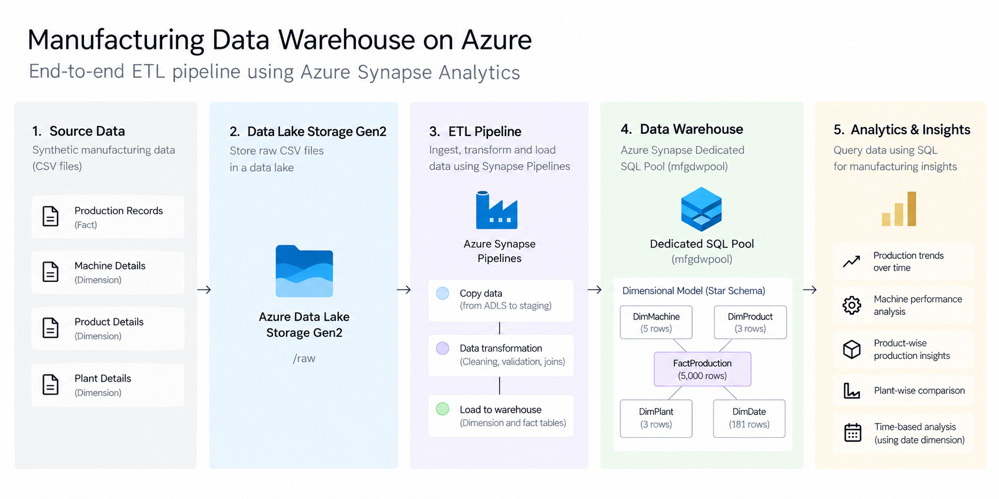
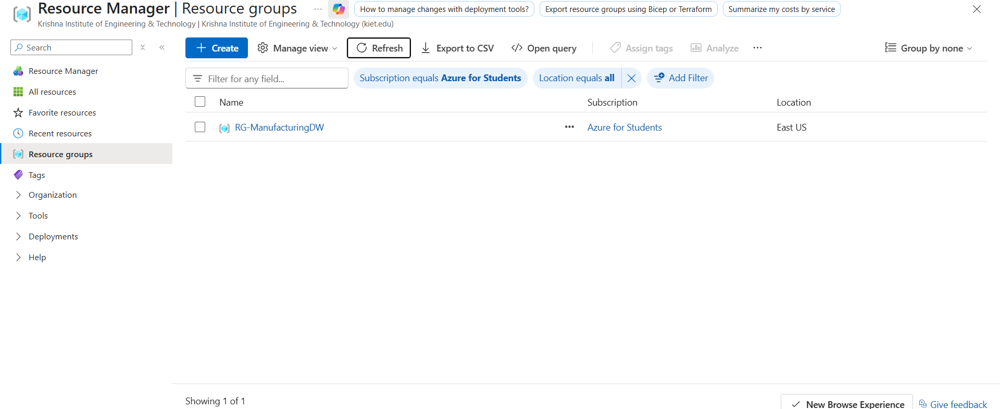
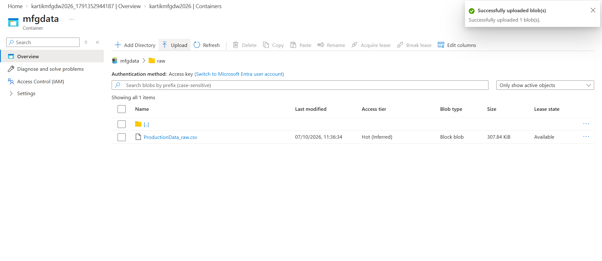
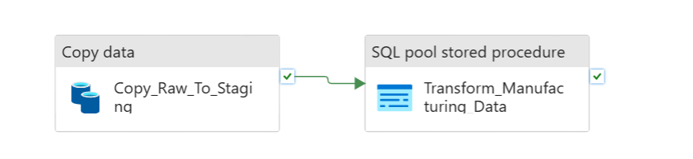
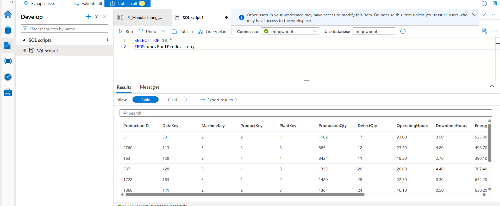
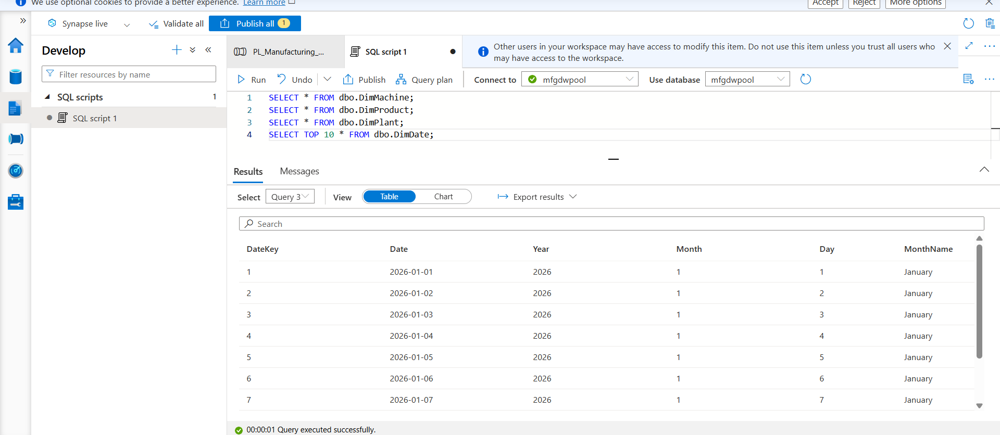
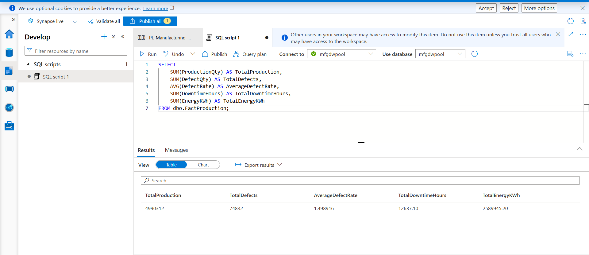

# Data Warehousing and ETL with Azure Synapse Analytics

**An end-to-end cloud data warehousing and ETL pipeline for manufacturing analytics using Microsoft Azure.**

---

## 📐 Architecture

---

## 📌 Project Overview

This project implements an end-to-end **data warehousing and ETL solution using Azure Synapse Analytics** for a manufacturing analytics use case.

The solution takes raw manufacturing production data, stores it in **Azure Data Lake Storage Gen2**, processes it through an **Azure Synapse ETL pipeline**, transforms the data using SQL, and loads it into a structured **star-schema data warehouse** for analytical querying.

### Data Flow

**Raw CSV → ADLS Gen2 → Synapse Pipeline → Staging → Transformation → Data Warehouse → SQL Analytics**

---

## 🎯 Objectives

- Build a cloud-based data warehouse using Azure Synapse Analytics.
- Implement a complete Extract, Transform, Load (ETL) workflow.
- Store raw manufacturing data using Azure Data Lake Storage Gen2.
- Perform data staging, cleaning, and transformation using SQL.
- Design a dimensional star-schema warehouse.
- Enable analytical queries for manufacturing performance.

---

## ☁️ Azure Services Used

| Azure Service | Purpose |
|---|---|
| **Azure Data Lake Storage Gen2** | Stores raw manufacturing data |
| **Azure Synapse Analytics** | Data warehousing and analytics platform |
| **Synapse Pipelines** | ETL orchestration and data movement |
| **Dedicated SQL Pool** | Structured data warehouse |
| **T-SQL** | Data transformation and analytical queries |

---

## 🔄 ETL Pipeline

The ETL workflow consists of two major stages:

### 1. Extract & Load

Raw manufacturing data is stored as a CSV file in Azure Data Lake Storage Gen2 and loaded into a Synapse staging table through the Synapse pipeline.

### 2. Transform & Load

SQL-based transformation processes the staged data and loads it into the dimensional warehouse model.

The warehouse consists of:

- `FactProduction`
- `DimMachine`
- `DimProduct`
- `DimPlant`
- `DimDate`

---

## 🏗️ Data Warehouse Model

The project follows a **star-schema architecture**.

### Fact Table

**FactProduction**

Contains production-level measurements including:

- Production quantity
- Defect quantity
- Operating hours
- Downtime hours
- Energy consumption
- Temperature
- Vibration

### Dimension Tables

- **DimMachine** — Machine information
- **DimProduct** — Product information
- **DimPlant** — Plant information
- **DimDate** — Date dimension for time-based analysis

---

## 📊 Project Results

The pipeline processed the manufacturing dataset successfully.

| Metric | Result |
|---|---:|
| Raw records | **5,003** |
| Clean warehouse records | **5,000** |
| Machines | **5** |
| Products | **3** |
| Plants | **3** |
| Date records | **181** |

### Analytical Results

| KPI | Result |
|---|---:|
| Total Production | **4,990,312** |
| Total Defects | **74,832** |
| Average Defect Rate | **~1.499%** |
| Total Downtime | **12,637.10 hours** |
| Total Energy Consumption | **2,589,945.20 kWh** |

---

## 🧪 Validation

The complete pipeline was executed successfully in Azure Synapse Analytics.

The warehouse was subsequently verified after resuming the dedicated SQL pool, confirming that the stored dimensional and fact data remained intact.

---

## 📸 Implementation Evidence

### Azure Resources

The project resources were deployed within a dedicated Azure Resource Group.

### Raw Data in Azure Data Lake Storage Gen2

The raw manufacturing dataset was stored in the `raw` container of Azure Data Lake Storage Gen2.

### ETL Pipeline

The Synapse pipeline orchestrates the movement of raw data into staging followed by the manufacturing data transformation.

### Fact Table

The transformed manufacturing records are loaded into the `FactProduction` table for analytical processing.

### Dimension Tables

The warehouse includes dimensional structures such as `DimMachine`, `DimProduct`, `DimPlant`, and `DimDate`.

### Analytical Results

SQL queries were used to calculate key manufacturing performance indicators from the completed warehouse.

